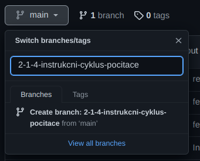
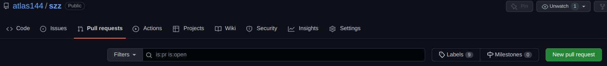

# Přispívání

## Software

Pro participaci na tvorbě materiálů je třeba mít nainstalovaný [GIT](https://git-scm.com/downloads) a jakýkoliv textový editor (ideálně [VSCodium](https://vscodium.com/#install) či jiný editor s podporou *VS Code Extensions*).

Proces publikování vytvořených materiálů zajišťuje CLI nástroj [mdBook](https://rust-lang.github.io/mdBook) (ke stažení [zde](https://github.com/rust-lang/mdBook/releases)). Po rozbalení archivu je ideální přidat cestu k binárce do `PATH`, poté není při volání nutné udávat celou její cestu.

## Nastavení prostředí

### Klonování repozitáře

``` bash
git clone https://github.com/atlas144/szz.git
```

### VS Code Extensions

Pokud používáte editor s podporou *VS Code Extensions*, doporučujeme nainstalovat tyto:

* [Markdown All in One](https://marketplace.visualstudio.com/items?itemName=yzhang.markdown-all-in-one)
* [Code Spell Checker](https://marketplace.visualstudio.com/items?itemName=streetsidesoftware.code-spell-checker)
* [Czech - Code Spell Checker](https://marketplace.visualstudio.com/items?itemName=streetsidesoftware.code-spell-checker-czech)
  * je nutné upravit `Předvolby > Nastavení > cSpell.language` na `en,cs`
* [Better TOML](https://marketplace.visualstudio.com/items?itemName=bungcip.better-toml)

## Postup

Řekněme, že budeme zpracovávat okruh *2.1.4. Instrukční cyklus počítače* (2.1.4. je číslo kapitoly, viz [seznam](https://atlas144.github.io/szz)).

### Příprava

Vytvoříme novou větev v větve `main` s názvem *2-1-4-instrukcni-cyklus-pocitace*:



Poté stáhneme změny pomocí

``` bash
git pull
```

a přesuneme se do nově vytvořené větve.

``` bash
git checkout 2-1-4-instrukcni-cyklus-pocitace
```

### Obsah

Nyní můžeme začít upravovat soubor pro daný okruh. Zdrojové soubory se nachází ve složce `./src` a následujících podsložkách podle předmětu. Zde `Informační a komunikační technologie > Architektura počítačů > Instrukční cyklus počítače`, cesta tedy je `./src/ikt/ap/instrukcni-cyklus-pocitace.md`.

Přidáváme-li obrázky či jiný dodatečný obsah, vytvoříme složku s názvem okruhu (zde tedy `./src/ikt/ap/instrukcni-cyklus-pocitace`) a obsah přidáváme do ní.

V průběhu editace je užitečné vidět finální podobu dokumentu. K tomu slouží náhledy v editoru:


Rovněž si lze výslednou podobu prohlédnou přímo pomocí *mdBook*, a to spuštěním příkazu

``` bash
mdbook serve --open             # pokud je lokace v PATH
[cesta]/mdbook serve --open     # pokud se binarka spousti primo
```

Změny je dobré průběžně commitovat a pushovat na server!

``` bash
git commit -m "feat(content): lorem ipsum"
git push
```

#### Formát zápisu

Obsah je zapisován ve formátu [Markdown](https://commonmark.org/help/) s rozšířeními, která jsou popsána [zde](https://rust-lang.github.io/mdBook/format/markdown.html).

Pro zápis matematických výrazů lze použít [MathJax](https://www.mathjax.org/) (s drobnými [omezeními](https://rust-lang.github.io/mdBook/format/mathjax.html)).

### Konec editace

Považujeme-li okruh za dokončený, vygenerujeme produkční verzi náhledu

``` bash
mdbook build
# nebo
[cesta]/mdbook build
```

uděláme commit, pushneme změny a následně otevřeme pull request ze zpracovávané větve (`2-1-4-instrukcni-cyklus-pocitace`) do `main`:



Po schválení se nově zpracovaný okruh objeví na [stránce](https://atlas144.github.io/szz).